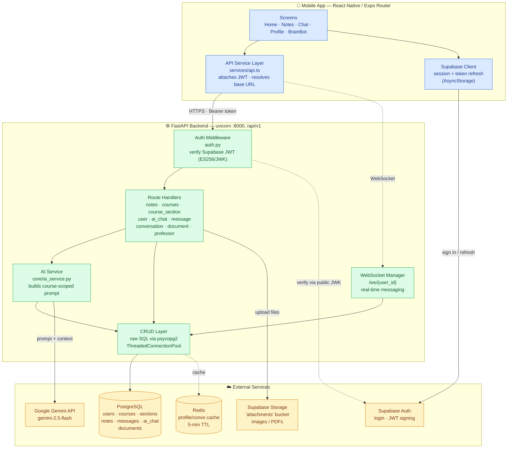
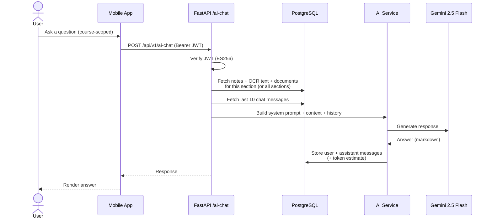
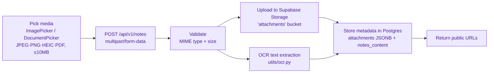
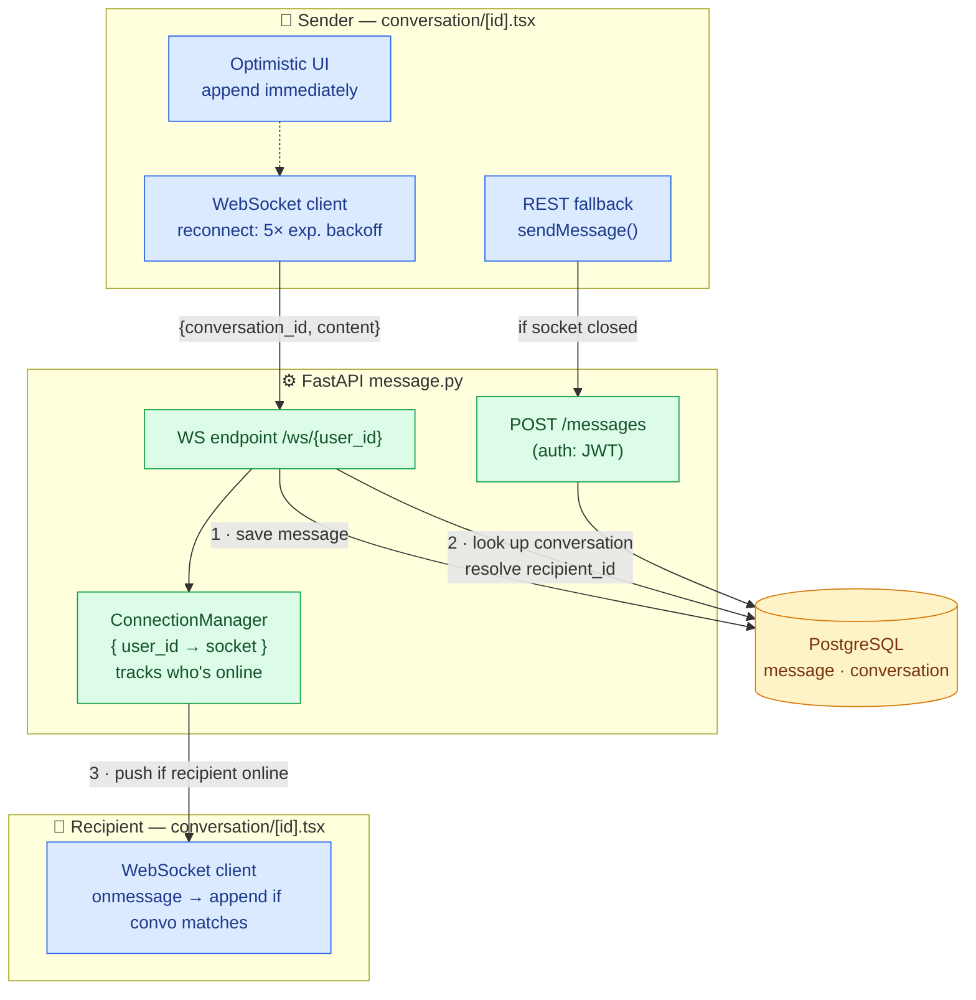
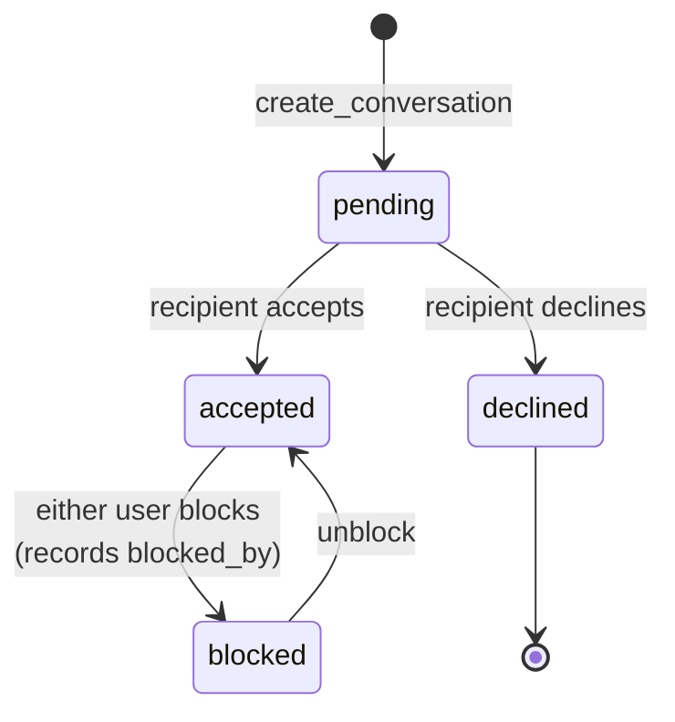

# BrainBank — Architecture

BrainBank is a mobile notes-sharing app for university students. Students enroll in course sections, upload notes (photos/PDFs), message classmates in real time, and use an AI tutor ("BrainBot") scoped to their courses.

**Stack:** React Native (Expo) · FastAPI (Python) · PostgreSQL · Supabase (Auth + Storage) · Google Gemini · Redis · WebSockets

---

## System Overview



---

## Highlight: AI Tutor (BrainBot) Request Flow

The chatbot is grounded in the student's own course material — it isn't a generic LLM wrapper.



**On-demand generation** reuses the same context pipeline: study guides, practice exams, and course summaries (`/ai-chat/study-guide`, `/practice-exam`, `/course-summary`), persisted to the `document` table and exportable as PDF.

---

## Highlight: Notes Upload Pipeline



OCR-extracted text lands in `notes_content`, which both powers search **and** feeds the AI tutor's context.

---

## Highlight: Real-Time Messaging

Direct messaging between classmates runs over a **WebSocket** with a REST fallback, plus a **store-and-forward** guarantee so no message is lost when the recipient is offline.

### Components



### Send-message sequence

```mermaid
sequenceDiagram
    actor A as Sender
    participant SC as Sender App
    participant WS as WS /ws/{user_id}
    participant CM as ConnectionManager
    participant DB as PostgreSQL
    participant RC as Recipient App

    Note over SC: On screen open — load history<br/>GET /messages (paginated) + mark read
    A->>SC: Type & send
    SC->>SC: Append optimistic message

    alt Socket OPEN
        SC->>WS: send { conversation_id, content }
        WS->>DB: create_message (persist)
        WS->>DB: get_conversation → resolve recipient_id
        WS->>CM: send_message(recipient_id, payload)
        alt Recipient online
            CM-->>RC: push message → append to thread
        else Recipient offline
            Note over CM,DB: no socket — message already saved;<br/>delivered on next GET /messages (store-and-forward)
        end
    else Socket closed
        SC->>WS: (unavailable) → REST fallback
        SC->>DB: POST /messages (JWT-authed) persists
        Note over SC: on failure, optimistic message rolled back
    end
```

### Conversation lifecycle



**Notes for the interview:**
- **Optimistic UI** — the sender's message renders instantly; the WS echo carries the server-assigned `message_id`.
- **Delivery guarantee** — the server *always persists first*, then attempts a live push. Offline recipients get the message on their next history fetch. No dropped messages.
- **Resilience** — the client auto-reconnects (1s→16s exponential backoff, 5 attempts) and falls back to `POST /messages` if the socket is down.
- **Read tracking & blocking** — `POST /conversations/{id}/read` records read state; conversation status gates whether messaging is allowed.
- ⚠️ **Known gap:** the WS endpoint trusts the `user_id` in the URL and isn't JWT-verified (unlike `POST /messages`). Worth calling out honestly as a hardening next step.

---

## Key Design Decisions

| Area | Choice | Notes |
|---|---|---|
| **Auth** | Supabase JWT, verified backend-side via ES256 public JWK | Backend never holds credentials; frontend handles refresh |
| **Data access** | Raw SQL (psycopg2) + ThreadedConnectionPool, no ORM | Explicit queries, pooled connections |
| **AI grounding** | Gemini prompt built from student's own notes + OCR + recent history | Course-scoped, not a generic chatbot |
| **File storage** | Supabase Storage (`attachments` bucket), URLs in Postgres | Files out of the DB; metadata in JSONB |
| **Real-time** | WebSocket `/ws/{user_id}` with store-and-forward | Instant if online, delivered on reconnect |
| **Caching** | Redis (optional), 5-min TTL on profiles/conversations | Graceful degradation if absent |
| **Dev UX** | Backend host auto-detected from Expo `hostUri` | No manual IP config for physical-device testing |

---

## Talking Points for the Interview

- **Clean layering:** screens → API service → auth → routes → CRUD → Postgres. Each domain has a matching route + CRUD module.
- **The AI feature is the differentiator:** retrieval of the student's *own* notes (incl. OCR'd handwriting/PDFs) as grounding context — a lightweight RAG-style pattern over per-user, per-course data.
- **Security posture:** stateless JWT verification with an asymmetric key, so the API trusts Supabase-signed tokens without a shared secret.
- **Pragmatic tradeoffs:** raw SQL over an ORM for control; optional Redis/Jaeger so the app runs fully without them in dev.
